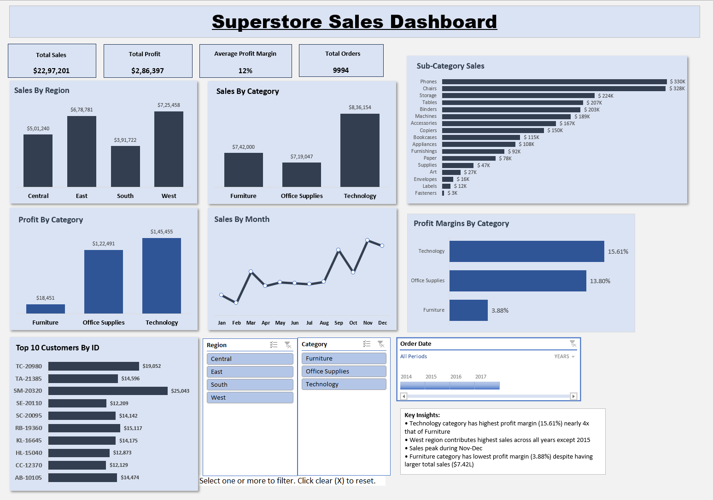

# excel-superstore-dashboard
## Overview
This project demonstrates an interactive Excel dashboard built using the Sample Superstore dataset. The dashboard provides insights into sales performance, profit trends, customer behavior, and category-wise business analysis.
 
The goal of this project was to practice data analysis, dashboard design, and business insight generation using Microsoft Excel.

## Tools and Excel Features Used
* Pivot Tables
* Pivot Charts
* Slicers
* Timeline Filter
* Excel Formulas
* Power Query
* Dashboard Layout & Design

## Dashboard Features
#KPI Metric Used
* Total Sales : It shows the total sales based on the options selected on the slicers.
* Total Profit :  It shows the total profit based on the options selected on the slicers.
* Average Profit Margin :  It shows the average of profit margins where profit margin is the ratio of profits to the sales based on the options selected on the slicers.
* Total Orders :  It shows the total number of orders placed based on the options selected on the slicers.

## Interactive Filters
* Region Slicer : Helps to filter results based on West, Central, East or South Region.
* Category Slicer : Helps to filter results based on Furniture, Office Supplies or Technology Category.
* Order Date Timeline : This is used to analyse results monthly, quarterly, yearly or on days basis.

## Visualizations Shown
* Sales by Region
* Sales by Category
* Profit by Category
* Monthly Sales Trend
* Sub-Category Sales Analysis
* Profit Margin by Category
* Top 10 Customers

## Key Insights
* West region generated the highest sales.
* Technology category had the highest profit margin.
* Furniture category showed comparatively low profitability.
* Sales peaked during November and December.
* Phones and Chairs were among the highest-selling sub-categories.

## Project Screenshot

